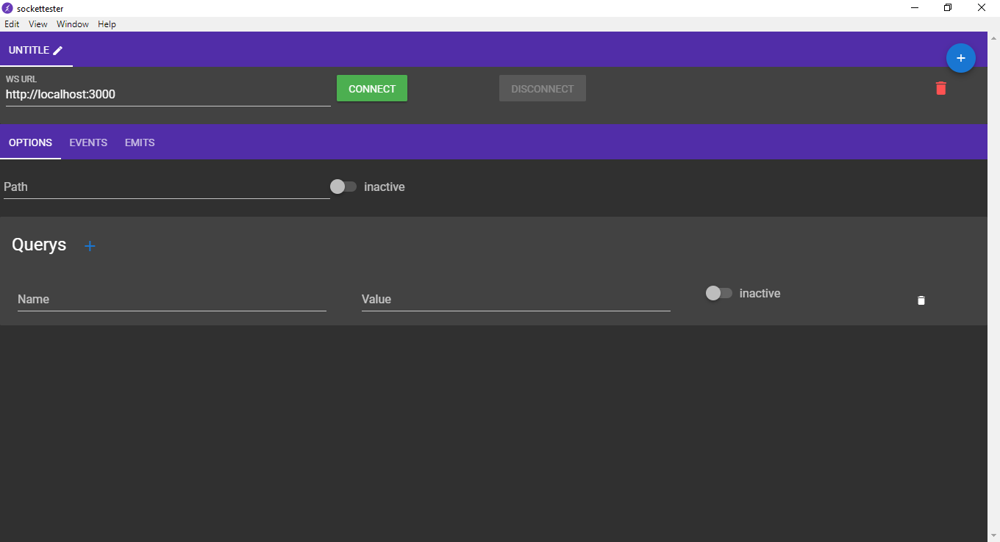
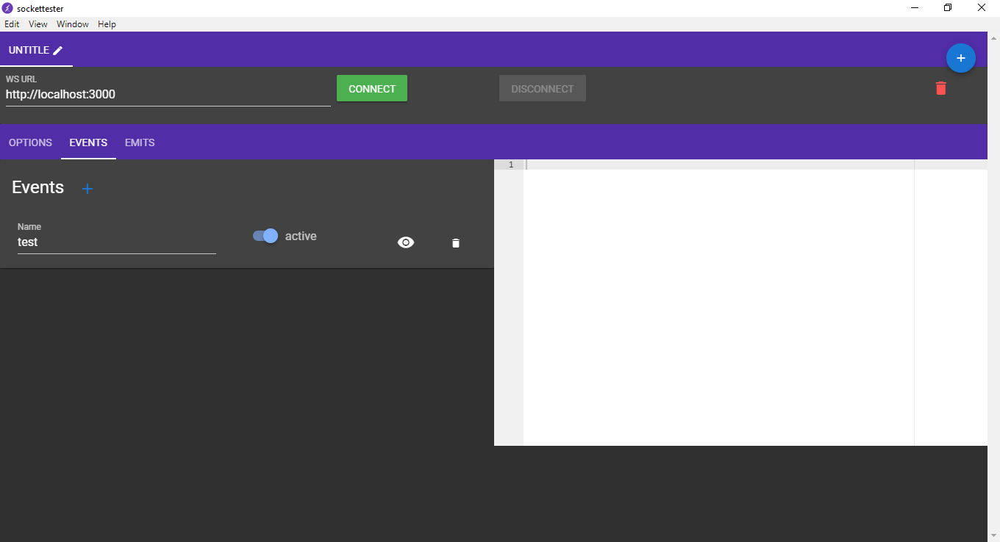
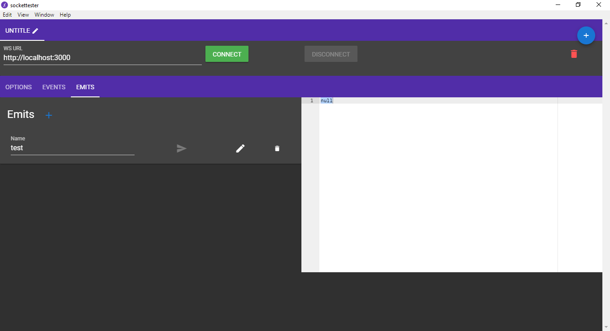

<div align="center">


</div>

<div align="center">

[](https://electron.io)


<br>
[](https://travis-ci.org/OsirisFrik/socketTester)
[](https://ci.appveyor.com/project/OsirisFrik/sockettester/branch/master)
<br>


<br>
<br>

 
<br>

<br>

</div>

## Features
- [x] Sockets tabs
- [x] Socket query
- [x] Socket path
- [x] Listen events
- [x] Emit events

## Roadmap
- [ ] App settings
- [ ] Export/Import data
- [ ] Ace theme custom

## Developer Notes

#### Build Setup

``` bash
# install dependencies
npm install

# serve with hot reload at localhost:9080
npm run dev

# build electron application for production
npm run build


# lint all JS/Vue component files in `src/`
npm run lint

# copy config.example.js in renderer to config.js by executing cp config.example.js config.js and set Mercury parser token
cp src/renderer/config.example.js config.js

```

For more documentation please follow link from [Electron Vue](https://simulatedgreg.gitbooks.io/electron-vue/content/)

## Powered by

- [Electron](https://electron.io)
- [Electron Vue](https://github.com/SimulatedGREG/electron-vue)
- [Vuetifyjs](https://vuetifyjs.com)
- [Vue](https://www.vuejs.org) & [Vuex](https://vuex.vuejs.org)
- [NeDB](https://github.com/jrop/nedb-promise)
